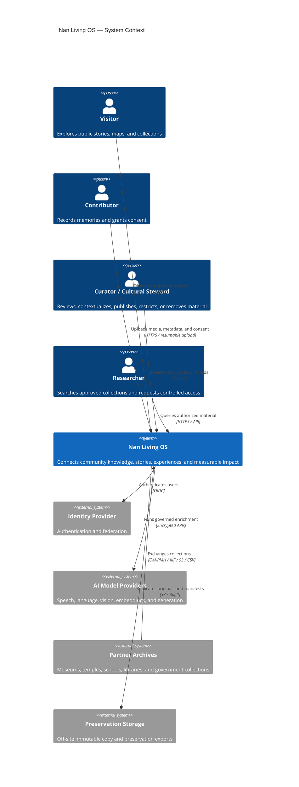
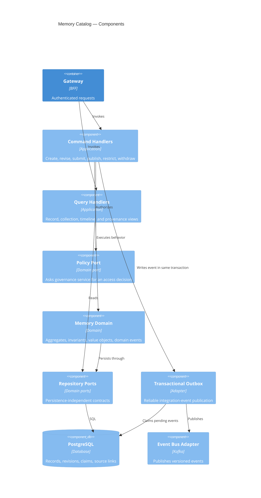
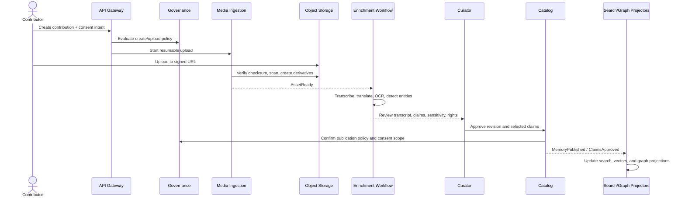
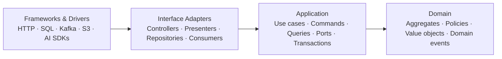
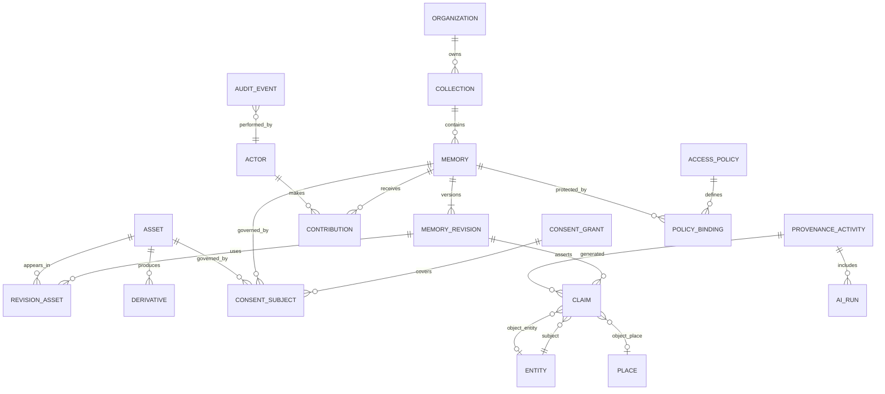
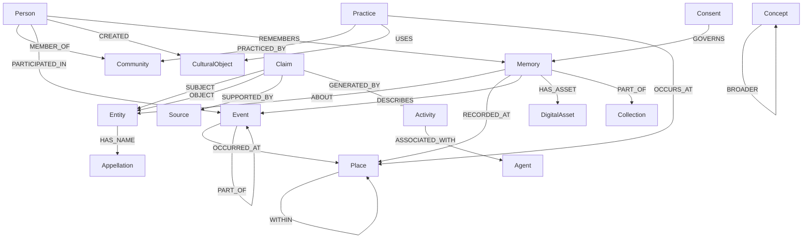

# Nan Living OS — Reference Architecture

## 1. Architectural intent

Nan Living OS is a consent-first knowledge infrastructure for collecting, preserving, connecting, and presenting oral histories, photographs, documents, places, people, traditions, and events related to Nan. It supports community contributors, curators, researchers, partner institutions, and public visitors.

### Quality attributes

- Cultural authority: community-defined labels, visibility, attribution, and takedown.
- Provenance: every assertion and AI output is traceable to sources, models, prompts, and human decisions.
- Preservation: immutable originals, checksums, format migration, versioned metadata, and exportability.
- Multilingual access: Thai, English, local names, transliterations, and extensible language variants.
- Privacy: field-level sensitivity, consent scope, embargoes, and relationship-based access.
- Graceful operation: asynchronous ingestion, idempotent jobs, offline-capable capture, and degraded read modes.
- Portability: open formats and APIs; no knowledge is trapped in the graph or vector store.

## 2. C4 diagrams

### Level 1 — System context



### Level 2 — Containers

```mermaid
C4Container
  title Nan Living OS — Containers
  Person(user, "Users", "Visitors, contributors, curators, researchers")
  Container(web, "Web / PWA", "Next.js", "Discovery, maps, story pages, capture, and curation")
  Container(api, "API Gateway / BFF", "Kotlin or TypeScript", "Auth, request composition, rate limits, policy enforcement")
  Container(core, "Memory Catalog", "Kotlin", "Records, collections, metadata, lifecycle, and versioning")
  Container(gov, "Identity & Governance", "Kotlin", "Tenancy, roles, consent, access policy, audit, takedown")
  Container(ingest, "Media Ingestion", "Go", "Uploads, checksums, derivatives, preservation packages")
  Container(workflow, "Enrichment Orchestrator", "Python + Temporal", "Durable AI and human-review workflows")
  Container(search, "Discovery Service", "Kotlin", "Lexical, semantic, faceted, spatial, and graph retrieval")
  Container(story, "Story & Exhibition", "Kotlin", "Curated narratives and published experiences")
  Container(integration, "Integration Service", "Kotlin", "IIIF, OAI-PMH, imports, exports, and webhooks")
  ContainerDb(pg, "PostgreSQL + PostGIS", "System of record", "Transactional metadata, policy, provenance, spatial data")
  ContainerDb(obj, "S3-compatible Object Storage", "Immutable blobs", "Originals, derivatives, manifests, exports")
  ContainerDb(os, "OpenSearch", "Search index", "Full text, facets, aliases, and denormalized read models")
  ContainerDb(graph, "Neo4j", "Knowledge graph projection", "Entities, claims, and traversals")
  ContainerDb(vector, "pgvector", "Vector projection", "Chunk and media embeddings")
  Container(queue, "Event Bus", "Kafka / Redpanda", "Integration events and outbox delivery")

  Rel(user, web, "Uses", "HTTPS")
  Rel(web, api, "Calls", "REST / GraphQL")
  Rel(api, core, "Commands and queries", "REST / gRPC")
  Rel(api, gov, "Authorization decisions", "REST / gRPC")
  Rel(api, search, "Searches", "REST")
  Rel(api, story, "Reads/publishes stories", "REST")
  Rel(core, pg, "Reads/writes")
  Rel(gov, pg, "Reads/writes")
  Rel(ingest, obj, "Stores media")
  Rel(ingest, pg, "Stores asset metadata")
  Rel(workflow, pg, "Stores jobs, claims, provenance")
  Rel(workflow, graph, "Projects approved claims")
  Rel(search, os, "Queries")
  Rel(search, vector, "Semantic retrieval")
  Rel(search, graph, "Graph expansion")
  Rel(story, pg, "Stores narratives")
  Rel(integration, queue, "Consumes/publishes")
  Rel(core, queue, "Publishes via outbox")
  Rel(ingest, queue, "Publishes asset events")
  Rel(workflow, queue, "Consumes and publishes enrichment events")
```



### Level 3 — Memory Catalog component model



### Dynamic flow — contribution to publication



## 3. Clean Architecture

Every service uses the same inward dependency rule:



- Domain: `MemoryRecord`, `Contribution`, `Asset`, `Collection`, `Story`, `ConsentGrant`, `AccessPolicy`, `Claim`, `Entity`, `ProvenanceActivity`; no framework imports.
- Application: use cases such as `SubmitContribution`, `ApproveRevision`, `PublishMemory`, `WithdrawConsent`, and `MergeEntity`; owns ports and transaction boundaries.
- Adapters: REST/gRPC handlers, PostgreSQL repositories, Kafka consumers, S3 storage, Neo4j/OpenSearch projectors, and AI-provider clients.
- Frameworks: runtime wiring, migrations, telemetry, deployment, and vendor SDKs.
- Cross-service changes use events and sagas; no distributed transactions. Each service owns its data. An outbox is mandatory for reliable publication.

## 4. Repository and folder structure

```text
nan-living-os/
├── apps/
│   ├── public-web/                 # Next.js SSR/PWA, accessible public discovery
│   ├── contributor-web/            # Offline-capable capture and upload
│   ├── curator-console/            # Review, governance, entity resolution
│   └── api-gateway/                # BFF, OpenAPI aggregation, auth context
├── services/
│   ├── catalog/
│   ├── governance/
│   ├── media-ingestion/
│   ├── enrichment/
│   ├── discovery/
│   ├── storytelling/
│   ├── notification/
│   └── integration/
│       └── src/
│           ├── domain/
│           ├── application/
│           │   ├── ports/in/
│           │   ├── ports/out/
│           │   └── usecases/
│           ├── adapters/
│           │   ├── inbound/http/
│           │   ├── inbound/events/
│           │   ├── outbound/persistence/
│           │   └── outbound/clients/
│           └── bootstrap/
├── packages/
│   ├── contracts/                  # OpenAPI, AsyncAPI, protobuf, JSON Schema
│   ├── design-system/
│   ├── observability/
│   ├── policy-models/              # Shared vocabulary, not shared business logic
│   └── test-fixtures/
├── ai/
│   ├── prompts/                    # Versioned prompt templates and safety rules
│   ├── evaluations/                # Golden sets, metrics, red-team cases
│   ├── schemas/                    # Structured model outputs
│   └── notebooks/                  # Exploration only; never production runtime
├── data/
│   ├── ontologies/                 # SHACL/JSON-LD contexts and mappings
│   ├── reference-data/             # Languages, administrative areas, vocabularies
│   └── migrations/
├── platform/
│   ├── terraform/
│   ├── kubernetes/
│   ├── observability/
│   └── local-dev/
├── docs/
│   ├── adr/
│   ├── threat-models/
│   ├── runbooks/
│   └── api/
└── tests/
    ├── contract/
    ├── end-to-end/
    ├── performance/
    └── preservation/
```

Use a monorepo initially for atomic contract changes and consistent engineering practices. Services remain independently deployable. Split repositories only when ownership or release cadence makes it necessary.

## 5. Microservice boundaries

| Service | Owns | Main events emitted |
|---|---|---|
| API Gateway / BFF | Client-shaped APIs, auth context, rate limits; no domain data | `ApiAbuseDetected` |
| Catalog | Memory records, revisions, collections, source links, publication lifecycle | `MemoryCreated`, `RevisionSubmitted`, `MemoryPublished`, `MemoryWithdrawn` |
| Governance | People/accounts, organizations, roles, consent grants, policies, access requests, audit | `ConsentGranted`, `ConsentChanged`, `AccessGranted`, `TakedownRequested` |
| Media Ingestion | Upload sessions, assets, fixity, virus scan, technical metadata, derivatives | `AssetReady`, `AssetQuarantined`, `DerivativeCreated` |
| Enrichment | AI jobs, transcripts, translations, suggestions, claims, model/prompt provenance | `TranscriptProposed`, `ClaimsProposed`, `EnrichmentFailed` |
| Discovery | Search documents, vector index, query orchestration, public read models | `SearchAnalyticsRecorded` |
| Storytelling | Stories, exhibits, tours, ordered canvases, publishing schedules | `StoryPublished`, `ExhibitPublished` |
| Notification | Template preferences and delivery state | `NotificationDelivered`, `NotificationFailed` |
| Integration | Partner mappings, imports/exports, IIIF/OAI feeds, webhooks | `ImportCompleted`, `ExportReady` |

Start physically with four deployables—Gateway, Core (Catalog + Governance + Storytelling modules), Media, and Worker (Enrichment + projections)—plus managed data infrastructure. Extract the logical services when scaling, security boundaries, or team ownership justify the operational cost.

## 6. API design

### Conventions

- External: REST/JSON under `/v1`; OpenAPI 3.1; cursor pagination; RFC 9457 problem details; `Idempotency-Key` on commands; `ETag`/`If-Match` for revisions.
- Aggregated discovery: optional persisted GraphQL queries through the BFF; never direct database-like graph access.
- Internal synchronous: gRPC or REST for policy checks and narrowly scoped queries.
- Asynchronous: AsyncAPI schemas, CloudEvents envelope, event version in `type`, schema compatibility checks, outbox/inbox deduplication.
- Identity: OIDC Authorization Code + PKCE; service identity through mTLS; scoped short-lived tokens.
- Every response is filtered by policy before serialization, including search snippets and graph neighbors.

### Public and contributor REST API

| Method and path | Purpose |
|---|---|
| `GET /v1/memories` | Faceted/cursor listing of accessible memories |
| `POST /v1/memories` | Create a draft contribution |
| `GET /v1/memories/{id}` | Read policy-filtered record and current revision |
| `PATCH /v1/memories/{id}` | Revise draft using `If-Match` |
| `POST /v1/memories/{id}/submit` | Submit for stewardship review |
| `POST /v1/memories/{id}/publish` | Publish an approved revision |
| `POST /v1/memories/{id}/withdraw` | Withdraw or restrict visibility without deleting provenance |
| `POST /v1/uploads` | Create resumable upload and signed part URLs |
| `POST /v1/uploads/{id}/complete` | Complete upload and start validation |
| `GET /v1/assets/{id}/manifest` | Retrieve IIIF Presentation 3 manifest where permitted |
| `POST /v1/consents` | Record signed, scoped, versioned consent |
| `POST /v1/consents/{id}/withdraw` | Revoke future uses and trigger enforcement workflow |
| `GET /v1/search` | Hybrid text/semantic/spatial search with facets |
| `GET /v1/entities/{id}` | Entity profile, aliases, sources, approved relations |
| `GET /v1/entities/{id}/neighbors` | Bounded, policy-filtered graph traversal |
| `POST /v1/access-requests` | Request access to restricted material |
| `GET /v1/stories/{slug}` | Published narrative/exhibition |

Example search request:

```http
GET /v1/search?q=weaving&language=th&place=nan&from=1940&to=1970&visibility=public&limit=20
```

Example event:

```json
{
  "specversion": "1.0",
  "type": "org.nanlivingmemory.catalog.memory-published.v1",
  "source": "catalog",
  "id": "01J...",
  "time": "2026-07-11T10:00:00Z",
  "subject": "memory/01J...",
  "datacontenttype": "application/json",
  "data": {
    "memoryId": "01J...",
    "revisionId": "01J...",
    "policySnapshotId": "01J...",
    "occurredBy": "actor/01J..."
  }
}
```

## 7. Database architecture

### Authoritative stores

- PostgreSQL 16 + PostGIS is the source of truth. Use UUIDv7/ULID identifiers, row-level tenant isolation as defense in depth, append-only revision/provenance tables, JSONB only for extensible typed metadata, and monthly partitioning for audit/outbox/job events.
- Object storage keeps immutable originals under content-addressed keys; enable versioning, retention lock, checksum verification, lifecycle tiers, cross-region copy, and BagIt/OCFL-compatible preservation manifests.
- OpenSearch, Neo4j, and pgvector are rebuildable projections. Never accept irreplaceable writes directly into them.

### Core relational model



Key table notes:

- `memory_revision`: immutable snapshot with `title`, `description`, `language`, `temporal_extent`, `spatial_extent`, `metadata`, `created_by`, `supersedes_id`.
- `claim`: atomic assertion with subject/predicate/object, confidence, status (`proposed`, `approved`, `rejected`, `disputed`), source locator, sensitivity, and validity interval.
- `consent_grant`: purpose, audience, channels, territory, start/end, withdrawal terms, captured form version, signature evidence, and steward notes.
- `policy_binding`: resource, policy, inherited-from, effective dates, and cached policy decision inputs.
- `ai_run`: provider/model revision, prompt version/hash, input hashes, parameters, output location/hash, metrics, reviewer, and decision.
- Deletion is a governed lifecycle: immediately hide from projections, revoke signed URLs, tombstone identifiers, retain only legally/preservationally permitted audit evidence, then verify downstream erasure.

### Backup and recovery

- PostgreSQL point-in-time recovery; encrypted daily full backups; quarterly restoration drills.
- Object fixity sweep and replica verification; preservation export independent of application schemas.
- Target: multi-AZ, RPO ≤ 5 minutes for metadata, RTO ≤ 4 hours; public read-only site can operate from a static snapshot during recovery.

## 8. Knowledge graph schema

Use a pragmatic property graph for traversal, backed by canonical claims in PostgreSQL. Publish interoperable JSON-LD aligned with CIDOC CRM, PROV-O, Dublin Core, SKOS, GeoSPARQL, and Web Annotation. Local cultural concepts extend the vocabulary under a versioned Nan namespace.



### Node types

`Person`, `Community`, `Organization`, `Place`, `Event`, `Memory`, `DigitalAsset`, `CulturalObject`, `Practice`, `Language`, `Concept`, `Collection`, `Appellation`, `Claim`, `Source`, `Activity`, `Agent`, `Consent`.

### Claim/provenance rules

- Relations are never naked facts: each edge projection references one or more canonical `claim_id` values.
- A claim records who/what asserted it, evidence location (asset + timecode/page/region), confidence, method (`human`, `import`, `AI`), review state, sensitivity, and valid time.
- Contradictory claims coexist and are displayed with sources; curators do not silently overwrite community testimony.
- Entity merges are reversible: aliases redirect to a canonical entity while all original IDs and decisions remain auditable.
- SHACL shapes validate required provenance, allowed predicates, temporal consistency, and consent/policy binding before public projection.

## 9. AI pipeline

```mermaid
flowchart LR
  A["1. Intake\nchecksum · malware scan · metadata"] --> B["2. Preprocess\nsegment · denoise · OCR frames · language ID"]
  B --> C["3. Extract\nASR · OCR · captions · translation"]
  C --> D["4. Structure\ntime-coded chunks · speakers · layout regions"]
  D --> E["5. Enrich\nentities · places · dates · topics · candidate claims"]
  E --> F["6. Retrieve context\nauthority files · gazetteer · approved graph"]
  F --> G["7. Validate\nschema · grounding · PII/sacred-content policy · confidence"]
  G --> H["8. Human review\ncorrect · approve · dispute · restrict"]
  H --> I["9. Publish projections\ntext · vector · graph · IIIF"]
  I --> J["10. Evaluate & monitor\nquality · drift · cost · appeals"]
```



### Orchestration and controls

- Temporal workflows provide retries, timeouts, compensation, versioned workflow code, and human-review pauses. GPU/batch work runs separately from API workloads.
- Each stage consumes immutable, hashed inputs and writes a versioned artifact. Outputs are structured against JSON Schema; free-form model output never writes directly to canonical records.
- Provider adapters allow local/private models for sensitive material and hosted models for public/approved content. The policy engine decides whether content may leave the trust boundary.
- Retrieval order: access-policy filter → lexical/vector candidates → graph expansion → rerank → answer. Filtering after retrieval is insufficient because snippets, embeddings, and logs can leak restricted material.
- Generative answers cite memory IDs and exact timecode/page/region. If support is weak, return sources and uncertainty rather than synthesize a fact.
- AI never publishes, merges identities, assigns sacred/sensitive status, or changes consent autonomously.

### Model tasks and evaluation gates

| Task | Output | Required evaluation |
|---|---|---|
| ASR + diarization | Time-coded transcript and speaker labels | WER/CER by language/dialect, timestamp error, named-entity recall |
| OCR | Text + page/region anchors | CER, layout accuracy, script-specific error sets |
| Translation | Segment-aligned variants | Human adequacy/faithfulness, names preserved, back-translation sampling |
| Entity linking | Candidate entity + evidence + score | Precision at review threshold, false-merge rate |
| Claim extraction | Typed proposed claims with source spans | Grounded precision, unsupported-claim rate |
| Embedding/retrieval | Ranked authorized chunks | nDCG/Recall@k, multilingual parity, restricted-content leakage = 0 |
| RAG responses | Answer + citations + uncertainty | Citation correctness, faithfulness, refusal and policy tests |

Maintain a steward-approved golden dataset across media types, languages, time periods, and communities. Promotion requires passing quality, privacy, cultural-safety, latency, and cost budgets; log model and prompt versions for rollback.

## 10. Security, governance, and operations

- Authorization combines RBAC (roles), ABAC (purpose, organization, consent, sensitivity), and relationship rules (contributor, subject, steward). Central policy decisions use versioned policy-as-code and are enforced at gateway, service, query, and delivery layers.
- Sensitivity levels: `public`, `community`, `restricted`, `sacred`, `embargoed`, `withdrawn`; labels propagate to derivatives, chunks, embeddings, graph claims, caches, and exports.
- Encrypt in transit and at rest; separate keys for highly sensitive collections; secrets in a managed vault; signed URLs are short lived and audience bound.
- Tamper-evident audit trail for reads of restricted material and all governance decisions. Avoid putting raw personal/cultural content in logs or traces.
- OpenTelemetry traces, metrics, and structured logs; SLOs per journey (upload completion, review queue, public search, policy decision). Dead-letter queues have replay tooling and runbooks.
- Supply-chain controls: signed artifacts, SBOM, dependency and container scanning, admission policies, and isolated media-processing workers.

## 11. Delivery sequence

1. Foundation: identity, governance vocabulary, consent model, catalog revisions, resumable media upload, audit, preservation storage.
2. Stewardship MVP: transcript/OCR workflow, human review, public record pages, lexical/spatial search, IIIF delivery, export/takedown.
3. Connected memory: canonical claims, entity resolution, knowledge graph projection, multilingual semantic retrieval.
4. Living experiences: stories, maps, exhibits, partner ingestion, citation-grounded assistant.
5. Scale and federation: archive federation, stronger offline capture, independent preservation node, selective service extraction.

### Key architecture decisions to record

- PostgreSQL is canonical; graph/search/vector are disposable projections.
- Consent and cultural policy precede AI processing and publication.
- Claims, provenance, and contradictions are first-class domain concepts.
- Originals are immutable; metadata and interpretations are versioned.
- Start as a modular monolith plus workers, retaining explicit service boundaries.
- AI produces proposals; authorized humans make culturally consequential decisions.
