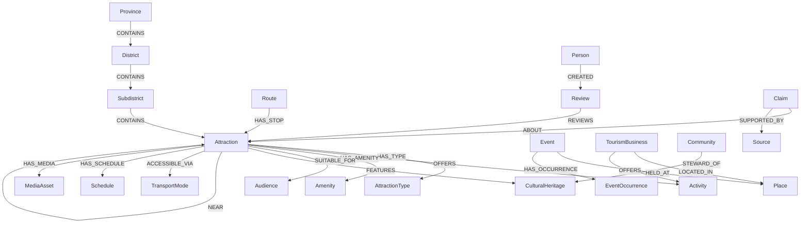

# Nan Tourism Knowledge Graph

## 1. Scope and design principles

This Neo4j-oriented graph supports destination discovery, itinerary planning, semantic search, recommendation, cultural storytelling, accessibility filtering, seasonal advice, and provenance-aware AI retrieval for Nan province.

The model separates:

- enduring entities such as places, attractions, events, communities, and tourism businesses;
- classifications such as attraction type, activity, theme, amenity, and audience;
- time-varying facts such as opening hours, event occurrences, prices, travel times, and closures;
- assertions and sources so disputed or changing tourism information is traceable.

PostgreSQL should remain the canonical transactional store for Nan Living OS. Neo4j is a rebuildable read projection optimized for discovery and traversal.

## 2. Conceptual graph



## 3. Node types

All domain nodes carry `id`, `status`, `createdAt`, and `updatedAt` where applicable. Public entities should use stable application IDs rather than Neo4j internal IDs.

| Label | Purpose | Important properties |
|---|---|---|
| `Province` | Top-level destination boundary | `id`, `nameTh`, `nameEn`, `code` |
| `District` | Amphoe-level administrative area | `id`, `nameTh`, `nameEn`, `code` |
| `Subdistrict` | Tambon-level administrative area | `id`, `nameTh`, `nameEn`, `code` |
| `Place` | Shared spatial super-label | `id`, `nameTh`, `nameEn`, `location: point`, `timezone` |
| `Attraction` | Visitor destination; also labeled `Place` | `id`, multilingual names/descriptions, `location`, `slug`, `status`, `accessLevel`, `typicalVisitMinutes` |
| `TourismBusiness` | Accommodation, restaurant, guide, shop, or transport provider; also `Place` | `id`, `businessType`, names, `location`, `licenseNo`, `status` |
| `Community` | Village, cultural group, or stewarding community | `id`, names, `description`, `accessLevel` |
| `CulturalHeritage` | Tradition, craft, cuisine, architecture, story, language, or living practice | `id`, names, `heritageType`, `sensitivity`, `status` |
| `NaturalFeature` | Mountain, river, forest, cave, viewpoint, or ecosystem | `id`, names, `featureType`, `sensitivity` |
| `Event` | Recurring or conceptual event | `id`, names, `eventType`, `description`, `status` |
| `EventOccurrence` | One dated instance of an event | `id`, `startsAt`, `endsAt`, `timezone`, `status`, `bookingUrl` |
| `Route` | Curated itinerary, trail, road trip, or walking route | `id`, names, `routeType`, `durationMinutes`, `distanceKm`, `difficulty` |
| `Activity` | Controlled vocabulary for visitor activities | `id`, `nameTh`, `nameEn`, `slug` |
| `AttractionType` | Controlled vocabulary such as temple, museum, national park | `id`, names, `slug` |
| `Theme` | Discovery concept such as architecture, food, nature, photography | `id`, names, `slug` |
| `Amenity` | Facility such as parking, toilets, wheelchair access, Wi-Fi | `id`, names, `slug` |
| `Audience` | Suitability vocabulary such as families, seniors, children | `id`, names, `slug` |
| `TransportMode` | Car, motorcycle, bicycle, walking, public transport | `id`, names, `slug` |
| `Schedule` | Versioned opening/admission schedule | `id`, `validFrom`, `validTo`, `timezone`, `status`, `notesTh`, `notesEn` |
| `MediaAsset` | Image, audio, video, panorama, or IIIF resource | `id`, `mediaType`, `uri`, `rights`, `altTh`, `altEn` |
| `Person` | Contributor, guide, artist, reviewer, or historical person | `id`, `displayName`, `visibility` |
| `Review` | Moderated user review | `id`, `rating`, `body`, `language`, `visitedOn`, `status` |
| `Claim` | Atomic, reviewable assertion about an entity | `id`, `predicate`, `value`, `confidence`, `method`, `reviewStatus`, `validFrom`, `validTo` |
| `Source` | Government page, community interview, archive, or partner feed | `id`, `title`, `uri`, `publisher`, `retrievedAt`, `license` |
| `Agent` | Human, organization, importer, or AI system responsible for an assertion | `id`, `name`, `agentType` |

### Label strategy

Use multiple labels for inheritance-like querying:

```text
(:Place:Attraction)
(:Place:TourismBusiness)
(:Place:Province)
(:Place:District)
(:Place:Subdistrict)
```

Do not create a new label for every attraction category. Represent categories as `AttractionType` nodes so they can be translated, renamed, hierarchically related, and managed without schema migrations.

## 4. Relationship types

| Relationship | From → To | Properties / semantics |
|---|---|---|
| `CONTAINS` | Administrative place → place/entity | `validFrom`, `validTo`, `sourceId` |
| `LOCATED_IN` | Attraction/business/place → administrative place | Canonical containment shortcut |
| `HAS_TYPE` | Attraction → AttractionType | Classification; optionally `confidence`, `sourceId` |
| `BROADER_THAN` | Vocabulary term → vocabulary term | Taxonomy; keep one direction consistently |
| `OFFERS` | Attraction/business → Activity | `seasonal`, `notes` |
| `HAS_THEME` | Attraction/route/event → Theme | `weight` from 0–1 for ranking |
| `HAS_AMENITY` | Attraction/business → Amenity | `status`, `verifiedAt`, `sourceId` |
| `SUITABLE_FOR` | Attraction/activity/route → Audience | `level`, `notes` |
| `FEATURES` | Attraction/event → heritage/natural feature | Why the entity is relevant |
| `STEWARD_OF` | Community/organization → heritage/attraction | `role`, `validFrom`, `validTo` |
| `HELD_AT` | Event → Place | Venue relationship |
| `HAS_OCCURRENCE` | Event → EventOccurrence | Dated instance |
| `HAS_SCHEDULE` | Attraction/business → Schedule | Effective schedule version |
| `OPEN_ON` | Schedule → weekday concept | `opens`, `closes`, `lastEntry`, `closed` |
| `ACCESSIBLE_VIA` | Place → TransportMode | `typicalMinutes`, `distanceKm`, `roadCondition`, `seasonal` |
| `NEAR` | Place → Place | Symmetric by application convention; `distanceMeters`, `walkingMinutes`, `calculatedAt` |
| `CONNECTS` | Route → Place | Start/end or broad connection |
| `HAS_STOP` | Route → Place | `sequence`, `recommendedMinutes`, `arrivalOffsetMinutes` |
| `NEXT_STOP` | Place → Place | Route-specific edge with `routeId`, `sequence`, `distanceKm`, `typicalMinutes` |
| `HAS_MEDIA` | Any public entity → MediaAsset | `role`, `sortOrder` |
| `CREATED` | Person/Agent → Review/MediaAsset | Attribution |
| `REVIEWS` | Review → Attraction/business | Exactly one target per review |
| `ABOUT` | Claim → domain entity | Claim subject |
| `SUPPORTED_BY` | Claim → Source | `locator` such as page, paragraph, or timecode |
| `ASSERTED_BY` | Claim → Agent | Human, import, or AI attribution |
| `DERIVED_FROM` | Claim/source/media → source/media | Provenance chain |
| `SAME_AS` | Entity → external authority entity | `scheme`, `externalId`, `confidence`, `reviewStatus` |

Avoid storing both `CONTAINS` and its inverse `LOCATED_IN` unless query latency justifies the duplication. When both are projected, create them in the same projector transaction and test their consistency.

## 5. Constraints

The following targets Neo4j 5.x. Run it once per database. Uniqueness constraints also create backing range indexes.

```cypher
CREATE CONSTRAINT province_id IF NOT EXISTS
FOR (n:Province) REQUIRE n.id IS UNIQUE;

CREATE CONSTRAINT district_id IF NOT EXISTS
FOR (n:District) REQUIRE n.id IS UNIQUE;

CREATE CONSTRAINT subdistrict_id IF NOT EXISTS
FOR (n:Subdistrict) REQUIRE n.id IS UNIQUE;

CREATE CONSTRAINT attraction_id IF NOT EXISTS
FOR (n:Attraction) REQUIRE n.id IS UNIQUE;

CREATE CONSTRAINT attraction_slug IF NOT EXISTS
FOR (n:Attraction) REQUIRE n.slug IS UNIQUE;

CREATE CONSTRAINT business_id IF NOT EXISTS
FOR (n:TourismBusiness) REQUIRE n.id IS UNIQUE;

CREATE CONSTRAINT community_id IF NOT EXISTS
FOR (n:Community) REQUIRE n.id IS UNIQUE;

CREATE CONSTRAINT heritage_id IF NOT EXISTS
FOR (n:CulturalHeritage) REQUIRE n.id IS UNIQUE;

CREATE CONSTRAINT natural_feature_id IF NOT EXISTS
FOR (n:NaturalFeature) REQUIRE n.id IS UNIQUE;

CREATE CONSTRAINT event_id IF NOT EXISTS
FOR (n:Event) REQUIRE n.id IS UNIQUE;

CREATE CONSTRAINT event_occurrence_id IF NOT EXISTS
FOR (n:EventOccurrence) REQUIRE n.id IS UNIQUE;

CREATE CONSTRAINT route_id IF NOT EXISTS
FOR (n:Route) REQUIRE n.id IS UNIQUE;

CREATE CONSTRAINT activity_id IF NOT EXISTS
FOR (n:Activity) REQUIRE n.id IS UNIQUE;

CREATE CONSTRAINT attraction_type_id IF NOT EXISTS
FOR (n:AttractionType) REQUIRE n.id IS UNIQUE;

CREATE CONSTRAINT theme_id IF NOT EXISTS
FOR (n:Theme) REQUIRE n.id IS UNIQUE;

CREATE CONSTRAINT amenity_id IF NOT EXISTS
FOR (n:Amenity) REQUIRE n.id IS UNIQUE;

CREATE CONSTRAINT audience_id IF NOT EXISTS
FOR (n:Audience) REQUIRE n.id IS UNIQUE;

CREATE CONSTRAINT transport_mode_id IF NOT EXISTS
FOR (n:TransportMode) REQUIRE n.id IS UNIQUE;

CREATE CONSTRAINT schedule_id IF NOT EXISTS
FOR (n:Schedule) REQUIRE n.id IS UNIQUE;

CREATE CONSTRAINT media_asset_id IF NOT EXISTS
FOR (n:MediaAsset) REQUIRE n.id IS UNIQUE;

CREATE CONSTRAINT person_id IF NOT EXISTS
FOR (n:Person) REQUIRE n.id IS UNIQUE;

CREATE CONSTRAINT review_id IF NOT EXISTS
FOR (n:Review) REQUIRE n.id IS UNIQUE;

CREATE CONSTRAINT claim_id IF NOT EXISTS
FOR (n:Claim) REQUIRE n.id IS UNIQUE;

CREATE CONSTRAINT source_id IF NOT EXISTS
FOR (n:Source) REQUIRE n.id IS UNIQUE;

CREATE CONSTRAINT agent_id IF NOT EXISTS
FOR (n:Agent) REQUIRE n.id IS UNIQUE;
```

For Neo4j Enterprise, add property-existence constraints for mandatory fields such as `id`, `nameTh`, and status fields. Keep these separate from the portable baseline because existence constraints are edition-sensitive.

## 6. Indexes

Create indexes from measured query patterns, not from every property.

```cypher
// Spatial lookup and radius search across all place-like nodes.
CREATE POINT INDEX place_location IF NOT EXISTS
FOR (n:Place) ON (n.location);

// Operational filtering.
CREATE INDEX attraction_status IF NOT EXISTS
FOR (n:Attraction) ON (n.status);

CREATE INDEX event_occurrence_window IF NOT EXISTS
FOR (n:EventOccurrence) ON (n.startsAt, n.endsAt);

CREATE INDEX schedule_validity IF NOT EXISTS
FOR (n:Schedule) ON (n.validFrom, n.validTo, n.status);

CREATE INDEX claim_review_state IF NOT EXISTS
FOR (n:Claim) ON (n.reviewStatus, n.predicate);

CREATE INDEX review_target_status IF NOT EXISTS
FOR (n:Review) ON (n.status, n.rating);

// Multilingual public discovery. Add descriptions only if index-size tests support it.
CREATE FULLTEXT INDEX tourism_entity_search IF NOT EXISTS
FOR (n:Attraction|TourismBusiness|Event|CulturalHeritage|NaturalFeature|Route)
ON EACH [n.nameTh, n.nameEn, n.aliases, n.descriptionTh, n.descriptionEn];

// Relationship indexes for route ordering and proximity filters.
CREATE INDEX route_stop_sequence IF NOT EXISTS
FOR ()-[r:HAS_STOP]-() ON (r.sequence);

CREATE INDEX near_distance IF NOT EXISTS
FOR ()-[r:NEAR]-() ON (r.distanceMeters);

CREATE INDEX support_locator IF NOT EXISTS
FOR ()-[r:SUPPORTED_BY]-() ON (r.locator);
```

Optional semantic search requires a fixed embedding dimension matching the chosen model. Example for 1,536 dimensions:

```cypher
CREATE VECTOR INDEX tourism_embedding IF NOT EXISTS
FOR (n:Attraction) ON (n.embedding)
OPTIONS {indexConfig: {
  `vector.dimensions`: 1536,
  `vector.similarity_function`: 'cosine'
}};
```

Prefer dedicated `ContentChunk` nodes when an entity has multiple multilingual descriptions or long source material; embedding one vector directly on `Attraction` cannot represent multiple languages, revisions, or access policies safely.

## 7. Complete Cypher schema bootstrap

The constraint and index blocks above are the schema migration. A production migration should also create controlled vocabulary values and schema metadata:

```cypher
MERGE (schema:GraphSchema {id: 'nan-tourism'})
ON CREATE SET
  schema.version = 1,
  schema.createdAt = datetime(),
  schema.description = 'Nan Tourism Knowledge Graph'
ON MATCH SET
  schema.updatedAt = datetime();

UNWIND [
  {id:'type-temple', nameTh:'วัด', nameEn:'Temple', slug:'temple'},
  {id:'type-museum', nameTh:'พิพิธภัณฑ์', nameEn:'Museum', slug:'museum'},
  {id:'type-national-park', nameTh:'อุทยานแห่งชาติ', nameEn:'National Park', slug:'national-park'},
  {id:'type-cultural-site', nameTh:'แหล่งวัฒนธรรม', nameEn:'Cultural Site', slug:'cultural-site'}
] AS row
MERGE (n:AttractionType {id: row.id})
SET n.nameTh = row.nameTh, n.nameEn = row.nameEn, n.slug = row.slug;

UNWIND [
  {id:'activity-sightseeing', nameTh:'เที่ยวชม', nameEn:'Sightseeing', slug:'sightseeing'},
  {id:'activity-photography', nameTh:'ถ่ายภาพ', nameEn:'Photography', slug:'photography'},
  {id:'activity-hiking', nameTh:'เดินป่า', nameEn:'Hiking', slug:'hiking'},
  {id:'activity-learning', nameTh:'เรียนรู้วัฒนธรรม', nameEn:'Cultural learning', slug:'cultural-learning'}
] AS row
MERGE (n:Activity {id: row.id})
SET n.nameTh = row.nameTh, n.nameEn = row.nameEn, n.slug = row.slug;

UNWIND [
  {id:'theme-culture', nameTh:'วัฒนธรรม', nameEn:'Culture', slug:'culture'},
  {id:'theme-history', nameTh:'ประวัติศาสตร์', nameEn:'History', slug:'history'},
  {id:'theme-nature', nameTh:'ธรรมชาติ', nameEn:'Nature', slug:'nature'},
  {id:'theme-architecture', nameTh:'สถาปัตยกรรม', nameEn:'Architecture', slug:'architecture'}
] AS row
MERGE (n:Theme {id: row.id})
SET n.nameTh = row.nameTh, n.nameEn = row.nameEn, n.slug = row.slug;
```

## 8. Sample data

The sample is deliberately illustrative. Verify coordinates, administrative mappings, opening hours, accessibility, event dates, and official names against authoritative or steward-approved sources before publication.

```cypher
// Administrative geography
MERGE (nan:Place:Province {
  id: 'province-nan', code: 'TH-55', nameTh: 'น่าน', nameEn: 'Nan',
  timezone: 'Asia/Bangkok'
})
MERGE (mueang:Place:District {
  id: 'district-mueang-nan', nameTh: 'อำเภอเมืองน่าน', nameEn: 'Mueang Nan'
})
MERGE (pua:Place:District {
  id: 'district-pua', nameTh: 'อำเภอปัว', nameEn: 'Pua'
})
MERGE (boKlueaDistrict:Place:District {
  id: 'district-bo-kluea', nameTh: 'อำเภอบ่อเกลือ', nameEn: 'Bo Kluea'
})
MERGE (nan)-[:CONTAINS]->(mueang)
MERGE (nan)-[:CONTAINS]->(pua)
MERGE (nan)-[:CONTAINS]->(boKlueaDistrict);

// Attractions: locations are example values and must be verified.
MATCH (mueang:District {id:'district-mueang-nan'}),
      (pua:District {id:'district-pua'}),
      (boKlueaDistrict:District {id:'district-bo-kluea'})
MERGE (phumin:Place:Attraction {id:'attraction-wat-phumin'})
SET phumin.slug = 'wat-phumin',
    phumin.nameTh = 'วัดภูมินทร์', phumin.nameEn = 'Wat Phumin',
    phumin.descriptionEn = 'Historic temple attraction in Nan city.',
    phumin.location = point({latitude:18.775, longitude:100.771}),
    phumin.status = 'published', phumin.accessLevel = 'public',
    phumin.typicalVisitMinutes = 60
MERGE (museum:Place:Attraction {id:'attraction-nan-national-museum'})
SET museum.slug = 'nan-national-museum',
    museum.nameTh = 'พิพิธภัณฑสถานแห่งชาติ น่าน', museum.nameEn = 'Nan National Museum',
    museum.location = point({latitude:18.776, longitude:100.771}),
    museum.status = 'published', museum.accessLevel = 'public',
    museum.typicalVisitMinutes = 90
MERGE (doiPhuKha:Place:Attraction {id:'attraction-doi-phu-kha'})
SET doiPhuKha.slug = 'doi-phu-kha-national-park',
    doiPhuKha.nameTh = 'อุทยานแห่งชาติดอยภูคา', doiPhuKha.nameEn = 'Doi Phu Kha National Park',
    doiPhuKha.location = point({latitude:19.20, longitude:101.08}),
    doiPhuKha.status = 'published', doiPhuKha.accessLevel = 'public',
    doiPhuKha.typicalVisitMinutes = 240
MERGE (saltVillage:Place:Attraction {id:'attraction-bo-kluea-salt-village'})
SET saltVillage.slug = 'bo-kluea-salt-village',
    saltVillage.nameTh = 'ชุมชนบ่อเกลือ', saltVillage.nameEn = 'Bo Kluea Salt Village',
    saltVillage.location = point({latitude:19.15, longitude:101.16}),
    saltVillage.status = 'published', saltVillage.accessLevel = 'public',
    saltVillage.typicalVisitMinutes = 120
MERGE (phumin)-[:LOCATED_IN]->(mueang)
MERGE (museum)-[:LOCATED_IN]->(mueang)
MERGE (doiPhuKha)-[:LOCATED_IN]->(pua)
MERGE (saltVillage)-[:LOCATED_IN]->(boKlueaDistrict);

// Classification and activities
MATCH (phumin:Attraction {id:'attraction-wat-phumin'}),
      (museum:Attraction {id:'attraction-nan-national-museum'}),
      (park:Attraction {id:'attraction-doi-phu-kha'}),
      (village:Attraction {id:'attraction-bo-kluea-salt-village'}),
      (temple:AttractionType {id:'type-temple'}),
      (museumType:AttractionType {id:'type-museum'}),
      (parkType:AttractionType {id:'type-national-park'}),
      (cultureType:AttractionType {id:'type-cultural-site'}),
      (sightseeing:Activity {id:'activity-sightseeing'}),
      (photo:Activity {id:'activity-photography'}),
      (hiking:Activity {id:'activity-hiking'}),
      (learning:Activity {id:'activity-learning'}),
      (culture:Theme {id:'theme-culture'}),
      (history:Theme {id:'theme-history'}),
      (nature:Theme {id:'theme-nature'}),
      (architecture:Theme {id:'theme-architecture'})
MERGE (phumin)-[:HAS_TYPE]->(temple)
MERGE (phumin)-[:OFFERS]->(sightseeing)
MERGE (phumin)-[:OFFERS]->(photo)
MERGE (phumin)-[:HAS_THEME {weight:0.9}]->(culture)
MERGE (phumin)-[:HAS_THEME {weight:0.9}]->(architecture)
MERGE (museum)-[:HAS_TYPE]->(museumType)
MERGE (museum)-[:OFFERS]->(learning)
MERGE (museum)-[:HAS_THEME {weight:0.9}]->(history)
MERGE (park)-[:HAS_TYPE]->(parkType)
MERGE (park)-[:OFFERS]->(hiking)
MERGE (park)-[:OFFERS]->(photo)
MERGE (park)-[:HAS_THEME {weight:1.0}]->(nature)
MERGE (village)-[:HAS_TYPE]->(cultureType)
MERGE (village)-[:OFFERS]->(learning)
MERGE (village)-[:HAS_THEME {weight:0.9}]->(culture);

// Proximity and a two-day illustrative route
MATCH (phumin:Attraction {id:'attraction-wat-phumin'}),
      (museum:Attraction {id:'attraction-nan-national-museum'}),
      (park:Attraction {id:'attraction-doi-phu-kha'}),
      (village:Attraction {id:'attraction-bo-kluea-salt-village'})
MERGE (phumin)-[:NEAR {
  distanceMeters: 250, walkingMinutes: 4,
  calculationMethod: 'illustrative', calculatedAt: datetime()
}]->(museum)
MERGE (museum)-[:NEAR {
  distanceMeters: 250, walkingMinutes: 4,
  calculationMethod: 'illustrative', calculatedAt: datetime()
}]->(phumin)
MERGE (route:Route {id:'route-nan-culture-nature-2d'})
SET route.nameTh = 'น่าน วัฒนธรรมและธรรมชาติ 2 วัน',
    route.nameEn = 'Nan Culture and Nature — 2 Days',
    route.routeType = 'road-trip', route.durationMinutes = 960,
    route.status = 'draft'
MERGE (route)-[:HAS_STOP {sequence:1, recommendedMinutes:60}]->(phumin)
MERGE (route)-[:HAS_STOP {sequence:2, recommendedMinutes:90}]->(museum)
MERGE (route)-[:HAS_STOP {sequence:3, recommendedMinutes:240}]->(park)
MERGE (route)-[:HAS_STOP {sequence:4, recommendedMinutes:120}]->(village);

// Provenance-aware assertion
MERGE (source:Source {id:'source-demo-curator-note'})
SET source.title = 'Demonstration curator note',
    source.publisher = 'Nan Living OS',
    source.retrievedAt = datetime(),
    source.license = 'internal-demo-only'
MERGE (curator:Agent {id:'agent-demo-curator'})
SET curator.name = 'Demonstration Curator', curator.agentType = 'human'
MATCH (phumin:Attraction {id:'attraction-wat-phumin'})
MERGE (claim:Claim {id:'claim-phumin-historic-temple-demo'})
SET claim.predicate = 'description',
    claim.value = 'Historic temple attraction in Nan city',
    claim.confidence = 1.0,
    claim.method = 'human',
    claim.reviewStatus = 'approved',
    claim.createdAt = datetime()
MERGE (claim)-[:ABOUT]->(phumin)
MERGE (claim)-[:SUPPORTED_BY {locator:'demonstration record'}]->(source)
MERGE (claim)-[:ASSERTED_BY]->(curator);
```

## 9. Representative queries

### Nearby public attractions of a chosen type

```cypher
MATCH (a:Place:Attraction)-[:HAS_TYPE]->(t:AttractionType {slug:$type})
WHERE a.status = 'published'
  AND point.distance(a.location, point({latitude:$lat, longitude:$lon})) <= $radiusMeters
RETURN a.id, a.nameTh, a.nameEn,
       round(point.distance(a.location, point({latitude:$lat, longitude:$lon}))) AS distanceMeters
ORDER BY distanceMeters
LIMIT $limit;
```

### Attractions combining culture, photography, and accessibility

```cypher
MATCH (a:Attraction)-[:HAS_THEME]->(:Theme {slug:'culture'})
MATCH (a)-[:OFFERS]->(:Activity {slug:'photography'})
MATCH (a)-[ha:HAS_AMENITY]->(:Amenity {slug:'wheelchair-access'})
WHERE a.status = 'published' AND ha.status = 'available'
RETURN a.id, a.nameTh, a.nameEn
ORDER BY a.nameTh;
```

### Ordered itinerary

```cypher
MATCH (r:Route {id:$routeId})-[stop:HAS_STOP]->(place:Place)
WHERE r.status IN ['published', 'draft']
RETURN stop.sequence AS sequence,
       place.id AS placeId,
       coalesce(place.nameEn, place.nameTh) AS name,
       stop.recommendedMinutes AS recommendedMinutes
ORDER BY sequence;
```

### Events within a date window

```cypher
MATCH (event:Event)-[:HAS_OCCURRENCE]->(occ:EventOccurrence)
MATCH (event)-[:HELD_AT]->(venue:Place)
WHERE occ.status = 'scheduled'
  AND occ.startsAt < $windowEnd
  AND occ.endsAt >= $windowStart
RETURN event.id, event.nameTh, event.nameEn,
       occ.startsAt, occ.endsAt, venue.nameTh, venue.nameEn
ORDER BY occ.startsAt;
```

### Evidence for a tourism fact

```cypher
MATCH (claim:Claim)-[:ABOUT]->(entity {id:$entityId})
MATCH (claim)-[support:SUPPORTED_BY]->(source:Source)
OPTIONAL MATCH (claim)-[:ASSERTED_BY]->(agent:Agent)
WHERE claim.reviewStatus IN ['approved', 'disputed']
RETURN claim.predicate, claim.value, claim.reviewStatus,
       source.title, source.uri, support.locator,
       agent.name, claim.validFrom, claim.validTo;
```

## 10. Best practices

### Modeling

- Model stable concepts as nodes and incidental values as properties. Promote a value to a node when it is shared, translated, hierarchical, independently managed, or traversed.
- Keep relationship direction canonical. Use `(:Route)-[:HAS_STOP]->(:Place)` and order with `sequence`; do not encode sequence in relationship type names.
- Represent recurring events separately from dated occurrences. Never overwrite last year's dates with this year's schedule.
- Use native temporal values (`date`, `time`, `localtime`, `datetime`, `duration`) and native WGS-84 `point` values, not strings.
- Put fast-changing values—hours, prices, road status, temporary closures—in versioned nodes or claims with validity windows and sources.
- Use multilingual fields for the first release. Introduce `Name` or `LocalizedText` nodes only when variants require their own provenance, script, status, or search behavior.

### Identity and data quality

- Use globally unique, immutable IDs. Names and slugs can change; IDs cannot.
- Make imports idempotent with `MERGE` on the constrained ID only, then `SET` properties. Avoid `MERGE` on full property maps.
- Preserve source-system IDs and mapping decisions. Keep uncertain duplicates separate until a curator approves a reversible merge.
- Validate projection payloads before writing. Neo4j does not replace application-level schema validation.
- Attach provenance to facts that change or may be disputed. An `Attraction` description may be cached for retrieval, but the canonical assertion should remain traceable through `Claim`.

### Performance

- Design indexes from actual `MATCH` and `WHERE` prefixes; verify with `EXPLAIN` and `PROFILE` on representative data volumes.
- Always bound traversals by relationship type, direction, maximum depth, status, access policy, and result limit. Avoid unbounded variable-length paths.
- Precompute `NEAR` only for frequently queried neighbors and refresh it when coordinates change. Use `point.distance` for ad hoc radius searches.
- Keep very large reviews, transcripts, and embeddings on chunk nodes or in purpose-built stores. Do not turn the graph into blob storage.
- Batch projection writes with `UNWIND`; use bookmarks for causal consistency. Use an outbox and idempotent consumer when projecting from PostgreSQL.
- Monitor query latency, page-cache hit ratio, heap pressure, store growth, index population, and slow-query plans.

### Safety, governance, and tourism accuracy

- Apply visibility and consent rules before graph expansion, vector retrieval, snippets, and ranking. Filtering only at response time can leak restricted nodes.
- Propagate sensitivity from heritage, community, media, and claims to every public projection. Sacred or fragile locations may require generalized coordinates or no map point.
- Treat opening hours, admission prices, accessibility, road conditions, and event dates as expiring claims. Display `verifiedAt` and source information to users.
- Separate editorial recommendation weights from observed popularity. Do not let review volume erase community priorities or promote environmentally sensitive places.
- Moderate reviews and prevent ratings from being attached to sacred traditions, people, or communities when culturally inappropriate.
- Record who approved AI-generated entity links, tags, translations, and descriptions. AI proposals must not become public graph facts automatically.

### Testing and lifecycle

- Run schema migrations before projectors start. Store graph schema version and projection checkpoint.
- Contract-test every event-to-graph mapping and test replay from an empty database.
- Add invariants: one current schedule per scope/date, unique route stop sequence, no public edge to a restricted node, valid event ranges, and reciprocal `NEAR` edges if symmetry is materialized.
- Back up Neo4j for operational recovery, but treat the canonical database and event log as the reconstruction source.
- Version taxonomies and deprecate terms through redirects; never silently reuse an identifier for a different concept.
